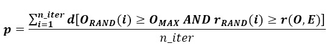
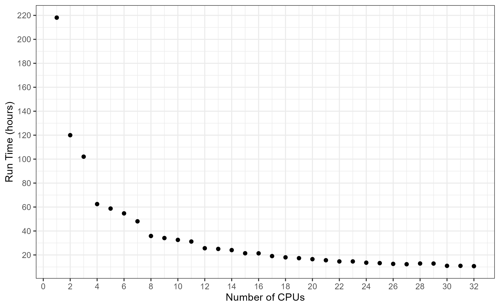

# Introduction

This document provides a brief tutorial for the R package 'kmcut'. The
main purpose of the package is to identify potential prognostic
biomarkers and an optimal numeric cutoff for each biomarker that can be
used to stratify a group of test subjects (samples) into two sub-groups
with significantly different survival (better vs. worse). Originally,
the package was intended to be used with variables that describe gene
expression, such as microarray or RNA-seq expression levels of
individual genes or gene signatures, such as single-sample Gene Set
Enrichment Analysis (ssGSEA) signatures. However, it can be used with
any quantitative variable that has a sufficiently large proportion of
unique values. The main requirement of the package is that for a group
of test subjects (samples) two types of data are available: (a)
right-censored survival time data and (b) at least one gene
expression-like feature with a large proportion of unique numeric values
describing each test subject (sample).

# Installation

The package can be installed from Bioconductor by utilizing the code below:

```{r, eval=FALSE}
BiocManager::install("kmcut")
```

The following packages need to be loaded:

```{r}
library(survival)
library(stringr)
library(data.table)
library(pracma)
library(tools)
library(foreach)
library(parallel)
library(doParallel)
library(kmcut)
```

# Preparing the input data

All core functions in the package require two input tab-delimited text
files:

1.  A file with right-censored survival data and

2.  A file with gene expression-like features. *The sample identifiers
    in both files must be exactly the same.* The package contains
    built-in example files with survival data and RNA-seq gene
    expression data that describe 295 neuroblastoma tumor samples
    (Zhang et al, 2015).

a)  The file with survival data must contain at least three columns
    labeled 'sample_id', 'stime', and 'scens'. Column 'sample_id'
    contains a unique identifier of each sample (test subject) and must be
    the first column in the file. Column 'stime' contains the survival
    time for each sample. Column 'scens' contains the censoring variable
    for each sample (0 or 1). If other columns are present in
    the file, they will be ignored. 'stime' and 'scens' can be in any
    column in the file, except the first. An example file with survival
    data is provided with the package, its content can be printed as
    follows (*the output of the code is not provided because it is too
    long*):

```{r}
sdat <- system.file("extdata", "survival_data_295.txt", package = "kmcut")
```

|            |       |       |
|------------|-------|-------|
| sample_id  | stime | scens |
| SEQC_NB001 | 1362  | 1     |
| SEQC_NB002 | 2836  | 1     |
| SEQC_NB003 | 1191  | 1     |
| SEQC_NB004 | 220   | 1     |
| SEQC_NB005 | 2217  | 0     |

Table 1. An illustration of the survival data file format for five
samples.

b)  The file with gene expression-like features must contain samples
    (subjects) in columns and features in rows. The first column must
    contain sample identifiers and and the first row must contain gene
    identifiers. An example file with gene expression features provided
    with the package, its content can be printed as follows (*the output
    of the code is not provided because it is too long*):

```{r}
fdat = system.file("extdata", "example_genes_295.txt", package = "kmcut")
```

+------------+-------------+-------------+-------------+-------------+-------------+
|tracking_id | SEQC_NB001  | SEQC_NB002  | SEQC_NB003  | SEQC_NB004  | SEQC_NB005  |
+------------+-------------+-------------+-------------+-------------+-------------+
|MYCN        | 4.16347458  | 3.464994927 | 8.494631614 | 8.438018327 | 5.509974474 |
+------------+-------------+-------------+-------------+-------------+-------------+
|MYH2        | 0.006539622 | 0.009077256 | 0           | 4.111214977 | 0.008735951 | 
+------------+-------------+-------------+-------------+-------------+-------------+

Table 2. An illustration of the file format for expression data with
two genes and five samples.

# Running the package and interpreting the output

## 'kmoptpermcut'

This function uses each distinct value of every feature from the dataset
as a stratification cutoff to select a cutoff that results in the
maximum separation of the Kaplan-Meier survival curves, and then
estimates the statistical significance of this optimal cutoff by means
of the permutation test. A detailed description of the steps implemented
in this function is provided below and is also available in our original
publication (Wei et al, 2018).

First, an ordered list C of all distinct values of a given feature
observed in the group of test subjects (samples) is created, all values
in the list being sorted from smallest to largest. Then, each value from
the list is used as a stratification cutoff: samples with the feature
below or equal to the cutoff are labeled as 'low' and above the cutoff
as 'high'. To avoid edge effects, if for a particular cutoff the size of
low or high sub-group is smaller than 'min_fraction' of the total number
of samples, this cutoff is discarded from the list. The log-rank test is
applied to compare survival distributions between the low and high
groups for each stratification cutoff, and the value of the test
statistic is recorded. After all stratification cutoffs from the list
are tested, the vector of the observed values of the test statistic is
created, O=(o~1~, o~2~ ,..., o~n~), where o~i~ is the observed value of
the test statistic for the cutoff c~i~ in the list C=(c~1~, c~2~ ,...,
c~n~). The cutoff that results in the largest value of the test
statistic, O~MAX~, is selected as the optimal cutoff, C~OPT~. If two or
more cutoffs result in the same observed value of the test statistic,
the cutoff closest to the median is selected.

Additionally, the shape of the plot of the observed values of the test
statistic is compared to the expected "ideal" plot. The empirical
assumption behind this comparison is that the "ideal" optimization
should produce a plot of the observed values of the test statistic with
exactly one peak, meaning that the values monotonically increase before
the peak and monotonically decrease after the peak. Initially, three
possible expected plots are defined: E~1~, E~2~, and E~3~. Each plot
consists of cutoff points from C, has a single peak, with the height of
this peak being equal to O~MAX~. In the plot E~1~ the peak is located at
the 25th percentile of all distinct values of the feature, in the plot
E~2~ at the 50th percentile, and in the plot E~3~ at the 75th
percentile. The final expected plot, E, is selected from (E~1~, E~2~,
E~3~) to minimize the distance from the location of its peak to C~OPT~.
The similarity of is quantified by the Spearman rank correlation between
the vectors of the observed and expected values, r(O, E).

The statistical significance of the stratification cutoff C~OPT~
obtained from the optimization procedure for a given feature is
estimated by means of a random permutation test run for 'n_iter'
iterations. On each iteration i, the sample labels in the survival data
and in the feature data are randomly shuffled, the same optimization
procedure is applied to the randomized data, and the largest value of
the observed test statistic O~RAND(i)~ and the Spearman rank correlation
between the observed and expected plot r~RAND(i)~ are recorded. After
all 'n_iter' iterations are completed, the p-value is calculated as
follows:

{width=80%}

where d[O~RAND(i)~ O~MAX~ AND r~RAND(i)~ r(O, E)] = 1 if on random iteration *i*
the largest value of the observed test statistic is equal to or greater than
O~MAX~ and the Spearman rank correlation between the observed and the expected
plot is equal to or greater than r(O, E). Otherwise,  
d[O~RAND(i)~ O~MAX~ AND r~RAND(i)~ r(O, E)] = 0.

The 'kmoptpermcut' function can be run in parallel on multiple processors by 
setting the `nproc` argument to the desired number of processors. The graph
below shows how the run time of the 'kmoptpermcut' function decreases when the
number of processors is increased. The results were obtained by using a data set
of 200 genes and 215 samples, with 10000 iterations per gene.
Benchmarking utilized the NIH High Performance Computing cluster
[Biowulf.](http://hpc.nih.gov)



An example of how to run 'kmoptpermcut' on 1 processor with the data files
included in the package:


```{r}
# Read names of the built-in gene expression data file and survival data file
fdat = system.file("extdata", "example_genes_295.txt", package = "kmcut")
sdat = system.file("extdata", "survival_data_295.txt", package = "kmcut")

# Run the permutation test for 10 iterations for each gene, use 1 processor
kmoptpermcut(fname = fdat, sfname = sdat, n_iter = 10, wlabels = TRUE,
                wpdf = FALSE, verbose = FALSE, nproc = 1)
```
Two graphs are created for each gene, MYCN and MYH2.  

One graph shows the observed optimization plot (blue circles) and the expected
optimization plot (green triangles). The optimal stratification cutoff is
highlighted by the red circle. The Spearman rank correlation between the
observed and the expected plots is printed after gene name. For instance, in
the case of MYCN the correlation is high, R = 0.827, indicating good
optimization. In the case of MYH2, the correlation is low and negative,
R = -0.115, indicating poor optimization.  
The other graph shows the Kaplan-Meier survival curves for groups with low and
high gene expression groups stratified using the optimal cutoff. The value of
this optimal cutoff and the p-value are printed after gene name. For instance,
in the case of MYCN gene, the optimal cutoff is 5.98357 and the p-value is 0 
(*note that in the figure the p-value is shown as exactly 0 because only 10
iterations of the permutation test were used in this example*).

The MYCN oncogene expression is known to be a strong predictor of
survival outcome for neuroblastoma patients - low expression levels
correspond to better survival, high expression levels correspond to poor
survival (Norris et al, 1997). The significant results of the optimization
for MYCN confirm this information.

The MYH2 gene encodes the myosin heavy chain 2, which is a protein found
in the muscle tissue and the level of its expression has nothing to do
with neuroblastoma survival (Smerdu et al, 1994). The statistically not
significant results of the optimization for MYH2 confirm this information.  

Additionally, this run will create the following two output files in the current
working directory (the names of output files will be created automatically by
adding the run information to the base name of the gene expression data file).

**a) Tab-delimited text file with the results**  
"example_genes_295_KMoptp_minf_0.10_iter_10.txt"

|             |            |        |       |        |        |      |       |
|-------------|------------|--------|-------|--------|--------|------|-------|
| tracking_id | CUTOFF     | CHI_SQ | LOW_N | HIGH_N | R      | P    | FDR_P |
| MYCN        | 5.98357    | 63.94  | 212   | 83     | 0.827  | 0    | 0     |
| MYH2        | 0.00219771 | 2.09   | 153   | 142    | -0.115 | 0.36 | 0.36  |

Table 3. An illustration of the file format for tab-delimited text
file with the results for two genes. 1st column -- gene id, 2nd --
optimal stratification cutoff, 3rd -- test statistic calculated for the
optimal cutoff, 4th -- number of samples in low-expression sub-group,
5th - number of samples in high-expression sub-group, 6th -- permutation
test p-value, 7th -- FDR-adjusted p-value.

**b) CSV file with low/high sample labels**  
"example_genes_295_KMoptp_minf_0.10_iter_10_labels.csv"

| sample_id  | MYCN | MYH2 |
|:-----------|:-----|:-----|
| SEQC_NB001 | 1    | 2    |
| SEQC_NB002 | 1    | 2    |
| SEQC_NB003 | 2    | 1    |
| SEQC_NB004 | 2    | 2    |
| SEQC_NB005 | 1    | 2    |

Table 4. An illustration of the file format for the CVS file with
low/high labels for two genes and five samples. 1st column -- sample
ids, all subsequent columns contain low/high labels for each gene, where
1 and 2 correspond to low- and high-expression sub-groups, respectively
('low' means below the cutoff and 'high' means above the cutoff).

## 'kmoptscut'

This function uses each distinct value of a given feature observed in
the dataset as a stratification cutoff to select a cutoff that results
in the maximum separation of the Kaplan-Meier survival curves, but does
not use the permutation test to estimate the statistical significance of
this optimal cutoff. 'kmoptscut' produces graphs and output files virtually
identical to the output of ['kmoptpermcut'] (except for the permutation
test p-value) and is meant to be used as a fast exploratory alternative
to ['kmoptpermcut']. An example of how to use 'kmoptscut' with the data
files included in the package:
```{r}
# Read names of the built-in gene expression data file and survival data file
fdat = system.file("extdata", "example_genes_295.txt", package = "kmcut")
sdat = system.file("extdata", "survival_data_295.txt", package = "kmcut")

# Run the function
kmoptscut(fname = fdat, sfname = sdat, wpdf = FALSE, verbose = FALSE)
```
Two graphs are created for each gene, MYCN and MYH2.  

Additionally, this run will create the following two output files in the current
working directory (the names of output files will be created automatically by
adding the run information to the base name of the gene expression data file).  

**a) Tab-delimited text file with the results**
"example_genes_295_KMopt_minf_0.10.txt  

**b) CSV file with low/high sample labels**
"example_genes_295_KMopt_minf_0.10_labels.csv"  

The format of these files is identical to the output files
described for function ['kmoptpermcut']. The only difference is that the
tab-delimited file with the results in column 'P' and the PDF file with
Kaplan-Meier curves contain the p-value obtained from the log-rank test
performed with the optimal cutoff. *This p-value is provided for
information purposes only and should not be treated as an actual p-value
because it does not reflect calculating multiple test statistics
involved in the optimization procedure applied to select the optimal
cutoff.*

## 'kmqcut'

For each feature, this function uses the cutoff supplied as a quantile
(from 0 to 100) to stratify samples into 2 groups (below and above this
quantile), plots Kaplan-Meier survival curves for these two groups and
calculates the log-rank test p-value. Since for each feature only one
cutoff corresponding to the specified quantile is used, it is equivalent
to performing one log-rank test per feature (that is, no optimization is
performed). An example of how to use 'kmqcut' with the data files
included in the package:
```{r}
# Read names of the built-in gene expression data file and survival data file
fdat = system.file("extdata", "example_genes_295.txt", package = "kmcut")
sdat = system.file("extdata", "survival_data_295.txt", package="kmcut")

# Use the 50th quantile (the median) to stratify the samples
kmqcut(fname = fdat, sfname = sdat, quant = 50, wpdf = FALSE)
```
A graph with Kaplan-Meier curves will be created for each gene, MYCN and MYH2.  

Additionally, this run will create the following two output files in the current
working directory (the names of output files will be created automatically by
adding the run information to the base name of the gene expression data file).  

**a) Tab-delimited text file with the results**
"example_genes_295_KM_quant_50.txt"  

**b) CSV file with low/high sample labels**
"example_genes_295_KM_quant_50_labels.csv"  

The format of these two files is identical to the output files
described for function ['kmoptpermcut'].

## 'kmucut'

For each feature, this function applies the user-supplied fixed value as
a cutoff to stratify samples into 2 groups (below/above this cutoff),
plots Kaplan-Meier survival curves for these two groups, and calculates
the log-rank test p-value. Since for each feature the same fixed cutoff
is used, it is equivalent to performing one log-rank test per feature
(no optimization is performed). An example of how to use 'kmucut' with
the data files included in the package:
```{r}
# Read names of the built-in gene expression data file and survival data file
fdat = system.file("extdata", "example_genes_295.txt", package = "kmcut")
sdat = system.file("extdata", "survival_data_295.txt", package = "kmcut")

# Use the cutoff = 5 to stratify the samples and remove features that have 
# less than 90% unique values (this removes the MYH2 gene from the analysis)
kmucut(fname = fdat, sfname = sdat, cutoff = 5, min_uval = 90, wpdf = FALSE)
```
A graph with Kaplan-Meier curves is created for gene (there is only MYCN here).  

Additionally, this run will create the following two output files in the current
working directory (the names of output files will be created automatically by
adding the run information to the base name of the gene expression data file).  

**a) Tab-delimited text file with the results**
"example_genes_295_KM_ucut_5.txt"  

**b) CSV file with low/high sample labels**
"example_genes_295_KM_ucut_5\_labels.csv"  

The format of these two files is identical to the output files described for
function ['kmoptpermcut'].   

## 'kmvalcut'

This function creates Kaplan-Meier survival curves for each feature in a
validation data file by using a file with previously determined
stratification cutoffs (one cutoff per feature) and calculates the
log-rank test p-value. Since for each feature only one previously
determined cutoff is used, it is equivalent to performing one log-rank
test per feature (no optimization is performed). The file with
previously determined stratification cutoffs is a tab-delimited file
with the table that contains one or more feature and a stratification
cutoff for each feature (the table is generated by functions
['kmoptscut'], ['kmoptpermcut'], ['kmqcut'] or ['kmucut']). It must have
first two columns named as 'tracking_id' and 'CUTOFF'. The 'tracking_id'
column contains gene (feature) names, the 'CUTOFF' column contains
stratification cutoff for each gene (feature). An example of how to use
'kmvalcut' to validate stratification cutoffs determined by
['kmoptpermcut']:
```{r}
# Read names of the built-in training (fdat1) and test (fdat2) gene expression 
# data files and survival data file (sdat)
fdat1 = system.file("extdata", "expression_data_1.txt", package = "kmcut")
fdat2 = system.file("extdata", "expression_data_2.txt", package = "kmcut")
sdat = system.file("extdata", "survival_data_295.txt", package = "kmcut")

# Step 1: Use training data (fdat1) to find the optimal classification cutoff 
# for each feature and estimate statistical significance.
# Results will be saved in file 
# "expression_data_1_KMoptp_minf_0.10_iter_100.txt"
kmoptpermcut(fname = fdat1, sfname = sdat, n_iter = 10,
                verbose = FALSE, min_uval = 90)
```
**Step 1 will create three output files in the current working directory:**

a)  PDF file with plots
    "expression_data_1\_KMoptp_minf_0.10_iter_100.pdf"  
b)  Tab-delimited text file with the optimization results
    "expression_data_1\_KMoptp_minf_0.10_iter_100.txt"  
c)  CSV file with low/high sample labels
    "expression_data_1\_KMoptp_minf_0.10_iter_100_labels.csv"  

The format of these three files is described in section ['kmoptpermcut']. 
The names of output files will be created automatically by adding the run
information to the base name of the gene expression data file.
```{r}
# Step 2: Use the file created during the step 1 above
# "expression_data_1_KMoptp_minf_0.10_iter_100.txt"
# to validate the optimal cutoffs on test expression data (file 'fdat2')
kmvalcut(input1 = "expression_data_1_KMoptp_minf_0.10_iter_10.txt",
            input2 = fdat2, sfname = sdat)
```
**Step 2 will create three output files in the current working directory:**

a)  PDF file with plots "expression_data_2\_KM_val.pdf"
b)  Tab-delimited text file with the validation results
    "expression_data_2\_KM_val.txt"  
c)  CSV file with low/high sample labels
    "expression_data_2\_KM_val_labels.csv"  

The format of these three files is identical to the output files
described for function ['kmoptpermcut']. *The only difference is that the
PDF file does not contain observed vs. expected optimization plots.*
The names of output files will be created automatically by adding the run
information to the base name of the gene expression data file.

## 'ucoxpred'

This function fits a univariate Cox proportional hazard regression model
for each feature in the training dataset and then uses the models to
calculate risk scores for the same features in the test dataset. An
example of how to use 'ucoxpred' with the data files included in the
package:
```{r}
# Read names of the built-in training (fdat1) and test (fdat2) 
# gene expression data files and survival data file (sdat).
fdat1 = system.file("extdata", "expression_data_1.txt", package = "kmcut")
fdat2 = system.file("extdata", "expression_data_2.txt", package = "kmcut")
sdat = system.file("extdata", "survival_data_295.txt", package = "kmcut")

# Build Cox model for the training data and use it to calculate risk 
# scores for the test data.
ucoxpred(fname1 = fdat1, sfname1 = sdat, fname2 = fdat2, sfname2 = sdat,
            min_uval = 90, verbose = FALSE)
```
This will create three output files in the current working directory:  

**a) Tab-delimited text file with Cox regression summary for the training data**  
"expression_data_1\_cox_train_sum.txt"  

|             |         |         |                      |                      |
|-------------|---------|---------|----------------------|----------------------|
| tracking_id | CC      | HR      | P                    | FDR_P                |
| MYCN        | 0.66449 | 1.29795 | 5.82806014522526e-06 | 5.82806014522526e-06 |

Table 5. An illustration of the file format for the tab-delimited text
file with Cox regression summary. 1st column -- gene id, 2nd --
concordance coefficient, 3rd -- hazard ratio, 4th -- likelihood ratio
test p-value, 5th -- FDR-adjusted p-value.

**b) Tab-delimited text file with the risk scores for the training data**  
"expression_data_1\_train_score.txt"  
In this file, rows are genes (features) and columns are samples.  

**c) Tab-delimited text file with the risk scores for the test data**  
"expression_data_2\_test_score.txt"  
In this file, rows are genes (features) and columns are samples.  

## Table manipulation

The package also contains the following functions that can be used to
manipulate data tables.

### 'extractrows'

This function extracts a sub-set of rows (such as a group of genes) from
a data table. All columns will be preserved. Names of the rows to be
extracted must be in a text file, one name per line (the exact names,
case-sensitive, no extra symbols are allowed). An example of how to use
the function with the data files included in the package:
```{r}
# Read the name of the built-in gene expression data file with 2 genes (2 rows)
fdat = system.file("extdata", "example_genes_295.txt", package = "kmcut")
# Read the name of the built-in list file that contains one gene id (MYCN)
idlist = system.file("extdata", "rowids.txt", package = "kmcut")

# Run the function
extractrows(fnamein = fdat, fids = idlist,
            fnameout = "example_genes_subset.txt")
```
This will create a tab-delimited text file "example_genes_subset.txt"
with one row "MYCN" in the  current working directory.

### 'extractcolumns'

This function extracts a sub-set of columns (such as a group of samples)
from a data table. All rows will be preserved. Names of the columns to
be extracted must be in a text file, one name per line (the exact names,
case-sensitive, no extra symbols are allowed). An example of how to use
the function with the data files included in the package:
```{r}
# Read the name of the built-in gene expression data file with 2 genes (2 rows)
fdat = system.file("extdata", "example_genes_295.txt", package = "kmcut")
# Read the name of the built-in list file that contains a sub-set of 
# column (sample) ids
idlist = system.file("extdata", "columnids.txt", package = "kmcut")

# Run the function
extractcolumns(fnamein = fdat, fids = idlist,
                    fnameout = "example_samples_subset.txt")
```
This will create a tab-delimited text file "example_samples_subset.txt"
in the  current working directory. This file will contain columns (samples)
from the list.

### 'transposetable'

This function transposes a data table (that is, converts rows to columns
and columns to rows). Row names will become column names, and column
names will become row names. An example of how to use the function with
the data file included in the package:
```{r}
# Read the name of the built-in gene expression data file.
# In this file, genes are rows and samples are columns.
fdat = system.file("extdata", "example_genes_295.txt", package = "kmcut")

# Run the function
transposetable(fnamein = fdat, fnameout = "example_genes_295_transposed.txt")
```
This will create a tab-delimited text file "example_genes_295_transposed.txt"
with the transposed table in the current working directory. In this file,
genes (features) are columns and samples are rows.

# Session Information
```{r}
sessionInfo()
```

# References

1) Zhang, W., Yu, Y., Hertwig, F., et al. (2015) [Comparison of RNA-seq and
microarray-based models for clinical endpoint prediction.]  
*Genome Biol.* **16**, 133.  
(https://genomebiology.biomedcentral.com/articles/10.1186/s13059-015-0694-1)  

2)  Wei, J.S., Kuznetsov, I.B., Zhang, S., et al. (2018) [Clinically Relevant
Cytotoxic Immune Cell Signatures and Clonal Expansion of T-Cell Receptors in
High-Risk MYCN-Not-Amplified Human Neuroblastoma.]  
*Clin. Cancer Res.* **24(22)**, 5673-5684.  
(https://clincancerres.aacrjournals.org/content/24/22/5673.long)  

3)  Norris, M.D., Bordow, S.B., Haber, P.S., et al. (1997) [Evidence that the
MYCN oncogene regulates MRP gene expression in neuroblastoma.]  
*Eur. J. Cancer* **33(12)**, 1911-1916.  
(https://pubmed.ncbi.nlm.nih.gov/9516823/)  

4)  Smerdu, V., Karsch-Mizrachi, I., Campione, M., et al. (1994) [Type IIx
myosin heavy chain transcripts are expressed in type IIb fibers of human
skeletal muscle.]  
*Am. J. Physiol.* **267(6 Pt 1)**, C1723-1728.  
(https://pubmed.ncbi.nlm.nih.gov/7545970/) 
